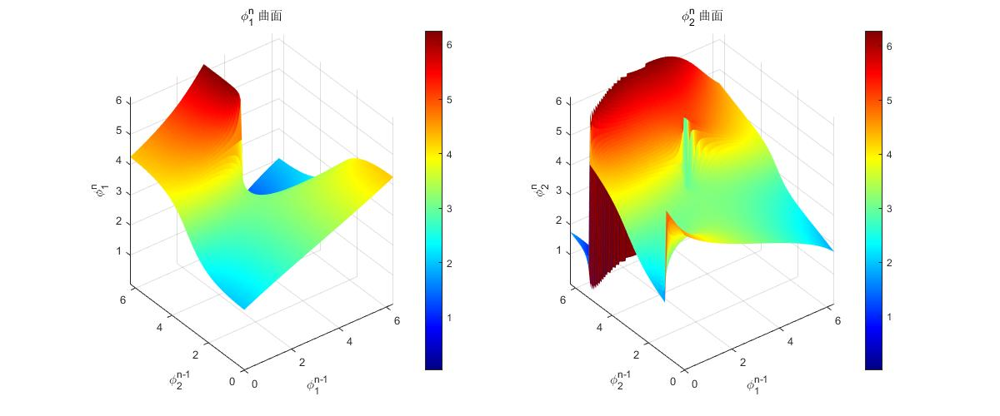

## formula_explain说明
plot_phi_surfaces()用于计算对于不同的$\phi_1^0和和\phi_2^0组合，经过一次迭代后的组合，经过一次迭代后的\phi_1和和\phi_2值。初始值值。初始值\phi_3^0可以人为指定也可以由可以人为指定也可以由\phi_1^0和和\phi_2^0$算出。调用该函数的输出如下：

plot_one_iterations(phi1_init, phi2_init, phi3_init, num_iterations)用于计算对于某一组$\phi_1^0和和\phi_2^0$的迭代情况。调用该函数的输出如下：

plot_nine_iterations()则是用于计算对于某九组$\phi_1^0和和\phi_2^0$的迭代情况。调用该函数的输出如下：

calculate_phis(phi1_n_minus_1, phi2_n_minus_1, phi3_n_minus_1, flag)是迭代算法的核心代码。flag=0代表由给的$\phi_1^{n-1}和和\phi_2^{n-1}计算出计算出\phi_3^{n}；flag=1代表\phi_3^{n}指定为指定为\phi_3^{n-1}$.
