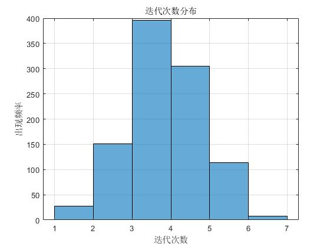

## formula_explain说明
plot_phi_surfaces()用于计算对于不同的$\phi_1^0$和$\phi_2^0$组合，经过一次迭代后的$\phi_1$和$\phi_2$值。初始值$\phi_3^0$可以人为指定也可以由$\phi_1^0$和$\phi_2^0$算出。调用该函数的输出如下：

plot_one_iterations(phi1_init, phi2_init, phi3_init, num_iterations)用于计算对于某一组$\phi_1^0$和$\phi_2^0$的迭代情况。调用该函数的输出如下：

plot_nine_iterations()则是用于计算对于某九组$\phi_1^0$和$\phi_2^0$的迭代情况。调用该函数的输出如下：

calculate_phis(phi1_n_minus_1, phi2_n_minus_1, phi3_n_minus_1, flag)是迭代算法的核心代码，其使用了算法的解析解。flag=0代表由给的$\phi_1^{n-1}$和$\phi_2^{n-1}$计算出$\phi_3^{n}$；flag=1代表将$\phi_3^{n}$指定为$\phi_3^{n-1}$.

## convergence_test说明
模拟实际调试步骤，给出收敛到某个相位精度需要给出多少次迭代。修改phase_points = linspace(0, 2*pi, 600)里的扫描个数可以模拟实际电压扫描的精度。由于扫描精度决定了收敛精度，所以收敛精度的判据根据扫描个数来确定。该代码的输出如下：

