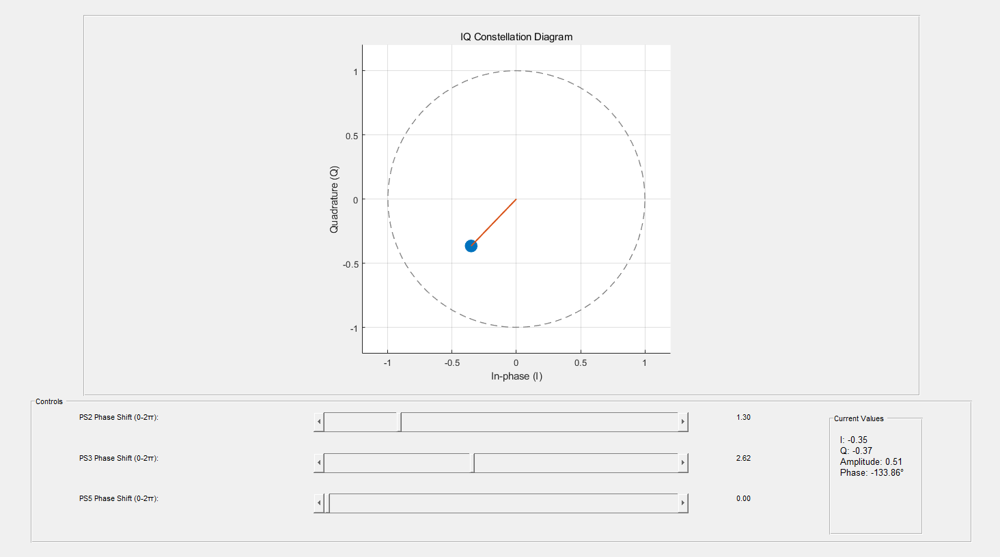
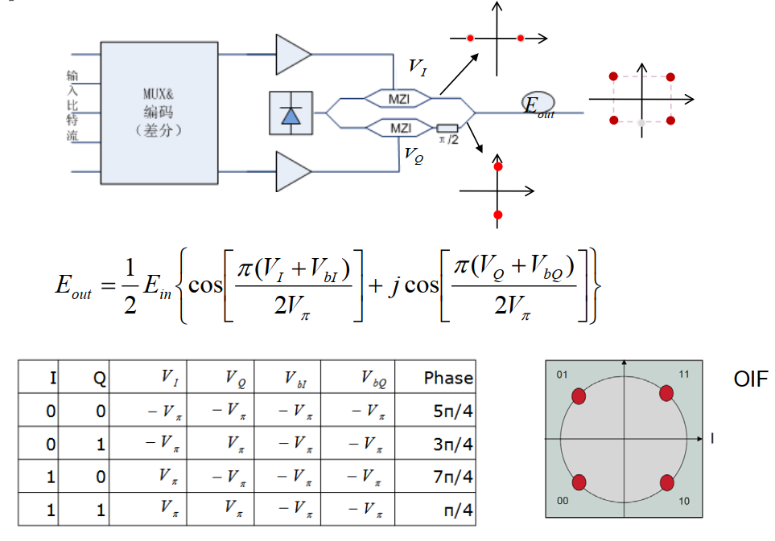
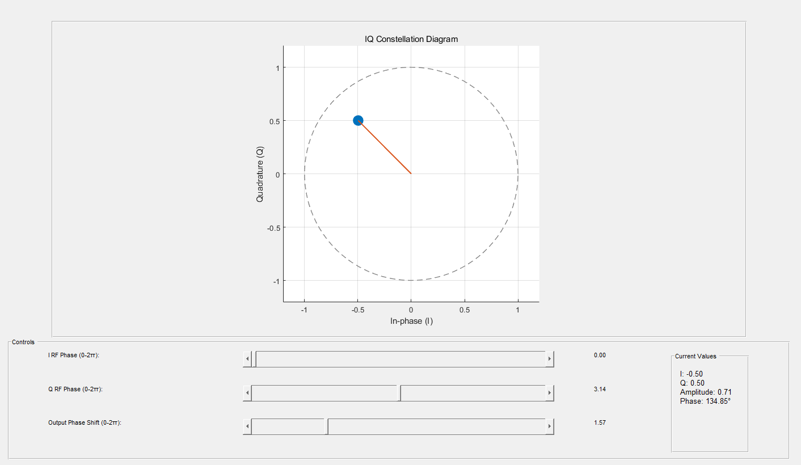
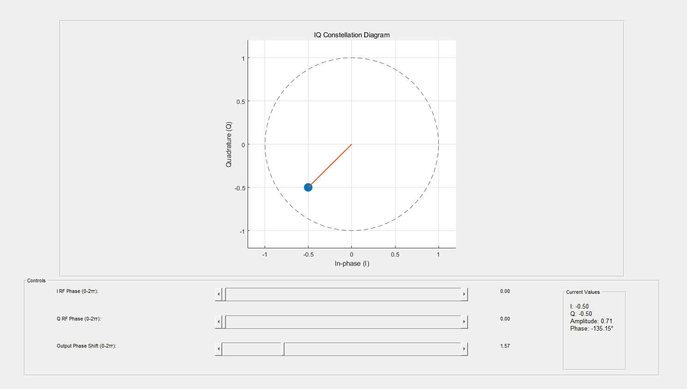

## layout_IQ_phase_space_gui说明
由单臂调制器做的MZI构成，由于单臂调制的MZI输出带相位，所以无法调出QPSK星座图。

## SEPP_IQ_phase_space_gui说明
由单端推挽调制器做的MZI构成（输出不带相位），市面上的铌酸锂调制器大多这样做：

单端推挽MZI调制器输出没有相位项，因此IQ输出是简单的Eup+jEdown形式，这与计算完全吻合：

